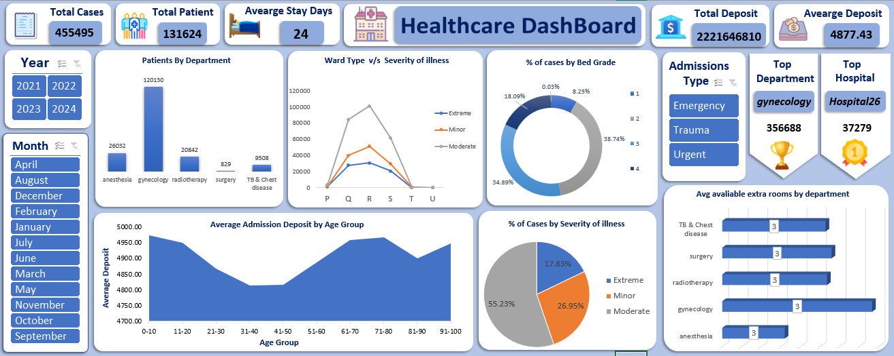

# HealthCare_Analysis_Excel_Dashboard

## 📌 Project Overview

The **Healthcare Analysis Dashboard** is a data-driven project designed
to help hospitals and healthcare organizations make **informed
decisions** through interactive reporting and visualization.
This project integrates **PostgreSQL** for data storage and querying,
and **Excel with Power Query & Power Pivot** for transformation,
modeling, and dashboard creation. With a **large dataset of \~455+ Lakh
patient records**, the dashboard provides deep insights into **hospital
operations, patient care, and financial performance**.

Key capabilities include:\
- Tracking **patient admissions, hospital utilization, and length of
stay**
-  Monitoring **admission deposits & financial contributions**
-  Analyzing **bed usage by grade and severity of illness**
-  Comparing **departments and hospitals by patient volume**
- Exploring **monthly and yearly trends** for better resource
planning

By combining **SQL-based analysis** with **Excel visualization**, this
project demonstrates the **end-to-end process of data engineering,
analytics, and dashboard reporting** in a healthcare setting.

---

##  Dashboard Preview  

  

---

------------------------------------------------------------------------

##  Objectives

-   Track **patient admissions & hospital utilization**
-   Monitor **financial performance (admission deposits)**
-   Analyze **bed usage by grade & severity of illness**
-   Support **decision-making for resource allocation** (rooms,
    departments)
-   Provide **monthly & yearly trend analysis**

------------------------------------------------------------------------

##  Project Processing -- How It Works

1.  **Database Creation**
    -   Import **train_data.csv** and **test_data.csv** into
        **PostgreSQL**
    -   Create database tables for both datasets
2.  **Data Preparation**
    -   Perform **data modification** (formatting, standardization)
    -   **Merge train & test datasets** into a single consolidated
        table
    -   Apply **data cleaning** (remove duplicates, handle nulls,
        correct values)
3.  **KPI & Query Analysis**
    -   Write SQL queries to calculate KPIs
    -   Generate required data for charts (department, hospital,
        severity, deposits, etc.)
4.  **Excel Integration**
    -   Connect SQL data to **Excel**
    -   Use **Power Query** for transformations (filtering, shaping,
        combining)
5.  **Data Modeling**
    -   Build relationships in **Power Pivot** (fact & dimension
        tables)
    -   Create measures (DAX formulas if needed)
6.  **Dashboard Creation**
    -   Load data into **Pivot Tables**
    -   Build interactive **charts & KPIs**
    -   Assemble into a **Healthcare Dashboard** with filters (monthly,
        yearly)

------------------------------------------------------------------------

##  Tech Stack

-   **SQL** -- Data extraction & transformation
-   **Excel (Power Query, Power Pivot, Pivot Tables, Charts)** -- Data
    modeling & visualization
-   **PostgreSQL** -- Database management system
-   **CSV Files (\~455,950 rows)** -- Large-scale training & testing
    datasets
-   **GitHub** -- Project documentation & version control

------------------------------------------------------------------------

##  Skills Applied

-   **SQL (PostgreSQL)** -- Writing queries for KPIs, aggregations, and
    data transformations
-   **Data Cleaning** -- Handling duplicates, missing values, and
    inconsistent data
-   **Data Integration** -- Merging multiple datasets (train & test)
    into one unified table
-   **ETL Process** -- Extracting from CSV, transforming in SQL/Power
    Query, loading into Excel
-   **Power Query** -- Data transformation and preparation in Excel
-   **Power Pivot** -- Data modeling, relationship building, and measure
    creation
-   **Data Visualization** -- Designing KPI cards, charts, and
    dashboards in Excel
-   **Analytical Thinking** -- Deriving insights for hospital resource
    allocation and performance tracking
-   **Large Dataset Handling** -- Managing and analyzing \~455k records
    efficiently

------------------------------------------------------------------------

##  Conclusion

The **Healthcare Analysis Dashboard** successfully demonstrates how
**large-scale healthcare data (\~455+ Lakh records)** can be transformed
into **actionable insights** using **SQL, Excel (Power Query & Power
Pivot), and visualization techniques**.
Through this project, hospital management can:
- Monitor **patient admissions, hospital utilization, and financial
performance**
- Analyze **bed occupancy, severity of illness, and departmental
efficiency**
- Support **data-driven decision making** with monthly and yearly trend
analysis

This project not only showcases **technical skills in SQL, Excel, and
data modeling**, but also highlights the **real-world impact of data
analytics** in improving healthcare operations and patient care.

------------------------------------------------------------------------

##  Author

**Nayan Patil**\
📧 nayangpatil22@gmail.com\
🔗 [LinkedIn](www.linkedin.com/in/nayan-patil-592058265) \| 
